# 模块一：界面展示与功能演示说明

**文档用途**：配合 `docs/mockups/module1/` 下的界面示意图，用于对内评审、对外路演、投资人或业务方演示。  
**对应范围**：仅 **模块一 — AI 事件分析 & 行业知识库**（见 `product-overview.md`）。  
**配图性质**：示意稿由 AI 生成，**布局与信息层级**供对齐；**具体文案、数据、股票名称**以 PRD 与最终实现为准。

---

## 一、配图文件一览

| 序号 | 文件名 | 建议演示环节 |
|------|--------|----------------|
| 1 | `module1-01-analysis-home.png` | 开场：产品定位与主入口 |
| 2 | `module1-02-streaming-output.png` | 体验：实时生成 |
| 3 | `module1-03-result-standard.png` | 结果：通用事件分析结构 |
| 4 | `module1-04-result-industry-chain.png` | 结果：产业链专项 |
| 5 | `module1-05-save-tags-modal.png` | 沉淀：保存与标签 |
| 6 | `module1-06-knowledge-industry-view.png` | 知识库：按行业复盘 |
| 7 | `module1-07-knowledge-timeline-view.png` | 知识库：按时间复盘 |
| 8 | `module1-08-knowledge-stock-view.png` | 知识库：按自选股关联 |
| 9 | `module1-09-knowledge-fulltext-search.png` | 检索：全文与筛选 |
| 10 | `module1-10-similar-question-hint.png` | 智能：防重复、可追溯 |
| 11 | `module1-11-major-events-reminders.png` | 计划：大事与提醒 |
| 12 | `module1-12-new-user-onboarding.png` | 拉新：首次使用引导 |

**目录路径**：`docs/mockups/module1/`

---

## 二、推荐演示顺序（两种时长）

### 2.1 快速版（约 5～7 分钟）

1. **01** 首页 → 一句话价值 + 五类事件 + 示例问题  
2. **02** 流式输出 → 「不用干等转圈」  
3. **04** 产业链结果 → 差异化能力  
4. **05** 保存弹窗 → 标题摘要 + 行业标签  
5. **06 / 07 / 08** 三视图各停留 10 秒 → 「三种方式找回记忆」  
6. **09** 搜索 → 能搜关键词、行业、代码  
7. **12** 新用户引导（可选）→ 降低首次使用门槛  

### 2.2 完整版（约 12～15 分钟）

按 **01 → 02 → 03 → 04 → 05 → 06 → 07 → 08 → 09 → 10 → 11 → 12** 顺序逐屏讲解，每屏使用下方「逐屏说明」中的话术要点。

---

## 三、逐屏说明（展示 + 功能演示要点）

### 01 — 分析首页 `module1-01-analysis-home.png`

**界面展示**  
- 左侧主导航：分析、知识库、大事提醒等与行情/自选区分（示意稿可能与最终 IA 微调）。  
- 中部：产品主张 + **五选一事件类型**（地缘政治 / 政策法规 / 财报季报 / 产业链分析 / 其他）。  
- 大输入框：用户描述新闻或事件。  
- **三个示例问题**：降低首次使用成本。  
- **最近分析**：缩短回访路径。

**演示时可说**  
> 「用户打开产品先看到『分析』，先选事件类型再描述问题；不懂问什么可以点示例；做过的事在最近分析里一键回去看。」

**功能对照（product-overview）**  
- 选事件类型、输入描述、新用户示例、回访入口。

---

### 02 — 流式输出 `module1-02-streaming-output.png`

**界面展示**  
- 生成中状态：分段文字逐渐出现，而非长时间白屏或仅转圈。

**演示时可说**  
> 「结果是一段段出来的，像打字机，用户马上有反馈，适合长文分析场景。」

**功能对照**  
- 流式输出。

---

### 03 — 标准分析结果 `module1-03-result-standard.png`

**界面展示**  
- 顶部 **一句话核心结论**（或摘要区），下面结构化章节：背景、逻辑、受益/受损行业、风险等。  
- 底部操作：**保存到知识库**、**再分析** 等。

**演示时可说**  
> 「除产业链外，其他类型也走同一套可读结构：先结论，再展开；看完可以一键存档。」

**功能对照**  
- 结构化结果（非产业链类型的通用形态）。

---

### 04 — 产业链分析结果 `module1-04-result-industry-chain.png`

**界面展示**  
- 在通用章节基础上，突出 **产业链传导表**（多层级：环节、方向、节奏、关注标的等，以 PRD 为准）。  
- 仍保留受益/受损与风险等模块。

**演示时可说**  
> 「选『产业链分析』时，多一张传导表，把事件怎么沿上下游传、先后节奏说清楚，这是和普通资讯工具的主要差别。」

**功能对照**  
- 产业链分析、传导表（最多 5 层等业务规则见 PRD）。

---

### 05 — 保存到知识库 `module1-05-save-tags-modal.png`

**界面展示**  
- 弹层：**自动生成标题**、**两句话摘要**（可改）。  
- **行业标签**：勾选；产业链场景下可按 **传导层分组** 展示（示意）。

**演示时可说**  
> 「存之前系统先起标题和摘要，用户扫一眼就能在列表里辨认；行业标签可改，避免 AI 标错；产业链时按层勾选更清楚。」

**功能对照**  
- 自动生成标题+摘要、申万行业类标签、保存前确认、产业链多行业展示。

---

### 06 — 知识库 · 行业视图 `module1-06-knowledge-industry-view.png`

**界面展示**  
- 顶部视图切换：**行业视图** 选中。  
- 按行业分组展开，下列历史文章标题。

**演示时可说**  
> 「复盘时如果想『我最近在石油、化工上积累了什么』，用行业视图最直观。」

**功能对照**  
- 三视图之一：行业视图。

---

### 07 — 知识库 · 时间线视图 `module1-07-knowledge-timeline-view.png`

**界面展示**  
- **时间线视图** 选中，按日期倒序卡片流，带摘要与标签。

**演示时可说**  
> 「按时间看『我每个月想了什么』，适合回顾宏观节奏和政策节点。」

**功能对照**  
- 三视图之一：时间线视图。

---

### 08 — 知识库 · 股票视图 `module1-08-knowledge-stock-view.png`

**界面展示**  
- **股票视图**：左侧自选股（或关注代码），右侧仅展示 **与该股相关的分析文章**。

**演示时可说**  
> 「已经维护自选股的话，可以直接看『哪些分析提到过这只票』，和后面的行情模块自然衔接。」

**功能对照**  
- 三视图之一：股票视图（按自选股筛选相关文章）。

---

### 09 — 全文搜索 `module1-09-knowledge-fulltext-search.png`

**界面展示**  
- 搜索框 + **关键词 / 行业 / 股票代码** 等筛选（具体字段以 PRD 为准）。  
- 结果列表高亮摘要。

**演示时可说**  
> 「文章多了以后，靠记忆找不到；搜索和筛选把个人知识库变成可用的数据库。」

**功能对照**  
- 全文检索、多条件筛选。

---

### 10 — 相似问题提醒 `module1-10-similar-question-hint.png`

**界面展示**  
- 输入区上方 **提示条**：例如曾分析过类似主题，可点击查看历史。

**演示时可说**  
> 「避免重复劳动，同时提醒用户『你以前已经想过这事』，形成连续思考。」

**功能对照**  
- 相似问题提醒。

---

### 11 — 大事提醒 `module1-11-major-events-reminders.png`

**界面展示**  
- 事件列表、日期、是否开启提醒、**一键触发分析** 等（布局可迭代）。

**演示时可说**  
> 「财报季、重要会议前设提醒，到点提醒并可一键再走一遍 AI 分析。」

**功能对照**  
- 大事提醒、临近提醒、与分析的联动（细节见 PRD）。

---

### 12 — 新用户引导 `module1-12-new-user-onboarding.png`

**界面展示**  
- 首次进入：**欢迎文案 + 三个示例卡片**；可跳过或进入主流程。

**演示时可说**  
> 「第一次来不知道问什么，我们直接用三个例子带用户跑通一条完整路径。」

**功能对照**  
- 新用户引导、示例问题（与 01 中示例一致的产品逻辑）。

---

## 四、演示开场白示例（可直接用）

> 「我们模块一解决两件事：第一，**看到新闻不知道影响哪些行业、哪些票**；第二，**分析过就忘、没法积累**。  
> 用户先选事件类型、描述问题，AI **流式** 给出结构化结论；需要深挖时选 **产业链**，会看到传导表。  
> 满意就 **保存**：自动标题和摘要，勾好行业标签。之后在 **知识库** 里用 **行业 / 时间 / 股票** 三种方式找回，再配合 **搜索**、**相似问题提醒** 和 **大事提醒**。  
> 下面我按界面一张张过一遍。」

---

## 五、附录

### 5.1 与 `product-overview.md` 模块一节点的映射

| product-overview 中的能力 | 示意配图 |
|---------------------------|----------|
| 五类事件类型 + 输入 + 示例 + 最近 | 01 |
| 流式输出 | 02 |
| 通用结构化结果 | 03 |
| 产业链 + 传导表 | 04 |
| 保存、标题摘要、行业标签 | 05 |
| 行业 / 时间线 / 股票 三视图 | 06、07、08 |
| 全文搜索与筛选 | 09 |
| 相似问题提醒 | 10 |
| 大事提醒 | 11 |
| 新用户引导 | 12 |

### 5.2 使用提示

- 在 Markdown 预览或幻灯片中插入图片时，路径示例：  
  `mockups/module1/module1-01-analysis-home.png`（相对本文件所在目录 `docs/`）。  
- 若信息架构调整（例如「大事提醒」是否独立导航），仅更新话术，不必重生成全部配图。  
- 对外演示建议保留本节「配图性质」说明，避免被理解为真实数据截图。

---

## 六、配图预览（本地 Markdown 预览 / 导出时可选用）

在编辑器中打开本文档并预览，可直接查看缩略图（路径相对于 `docs/`）。

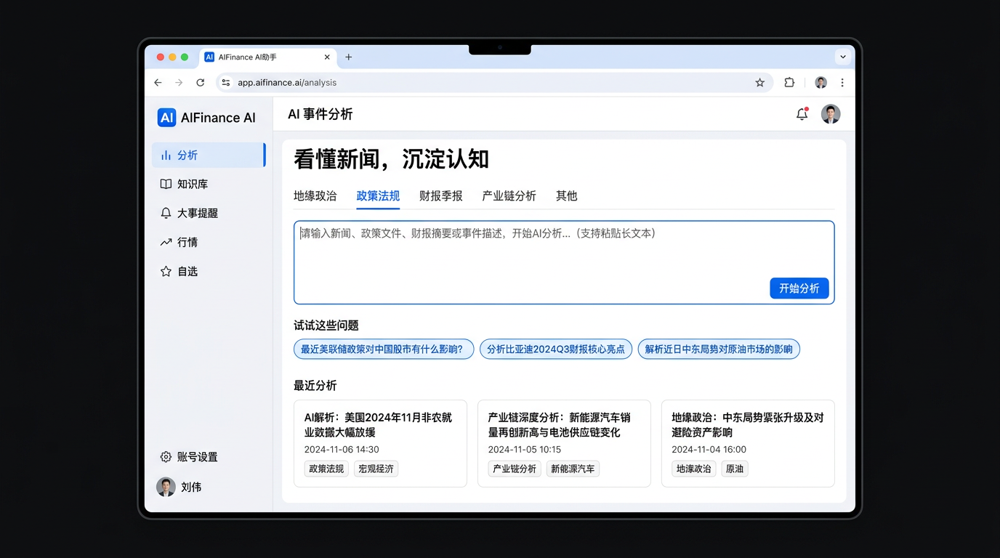

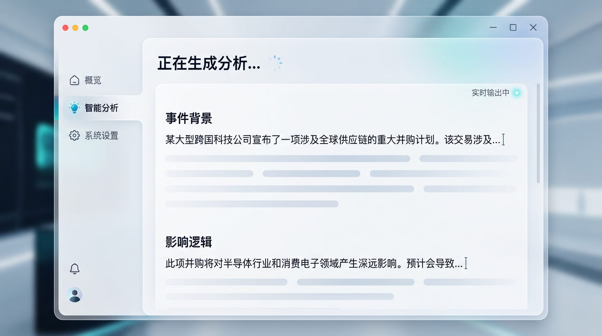

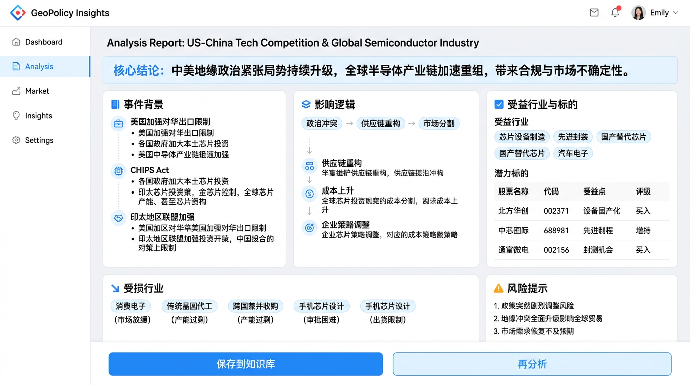

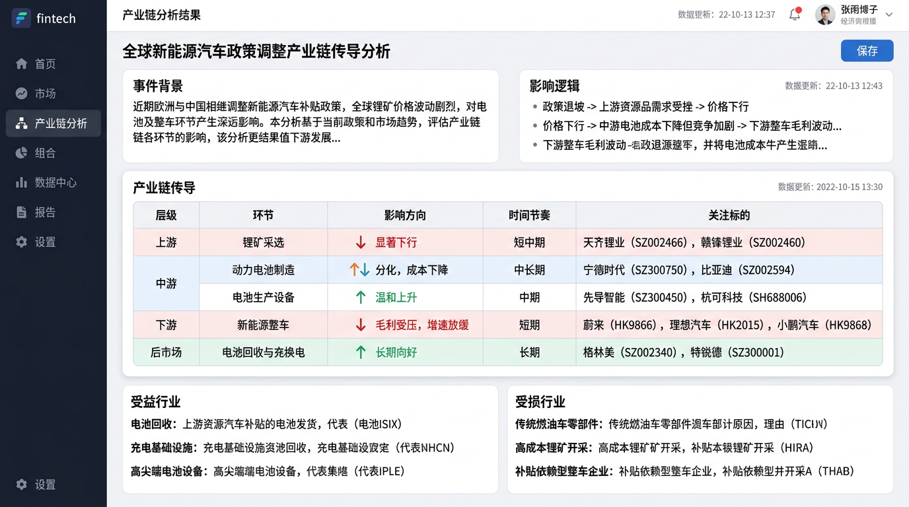

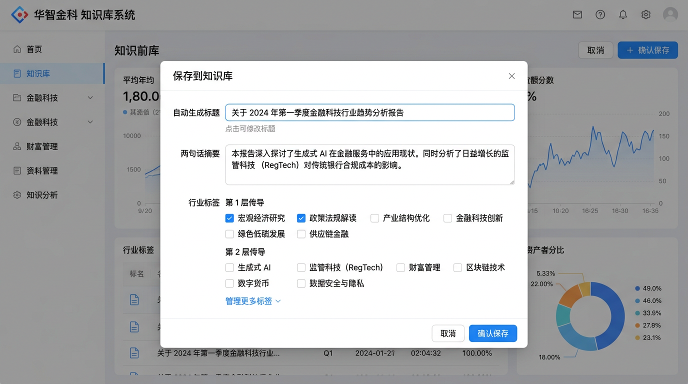

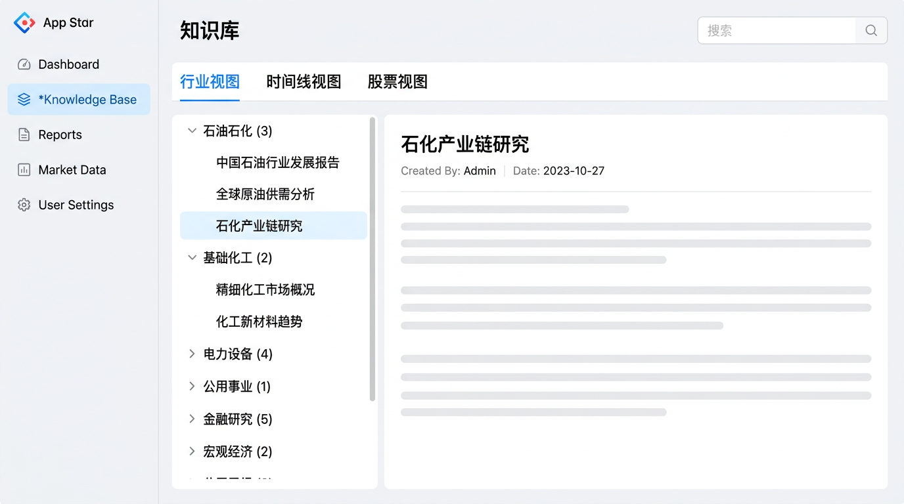

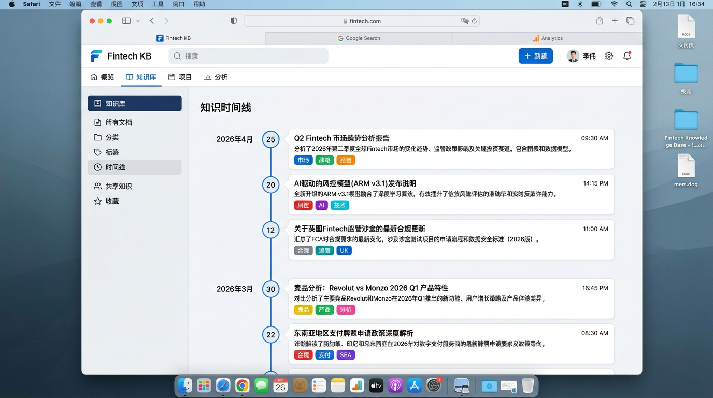

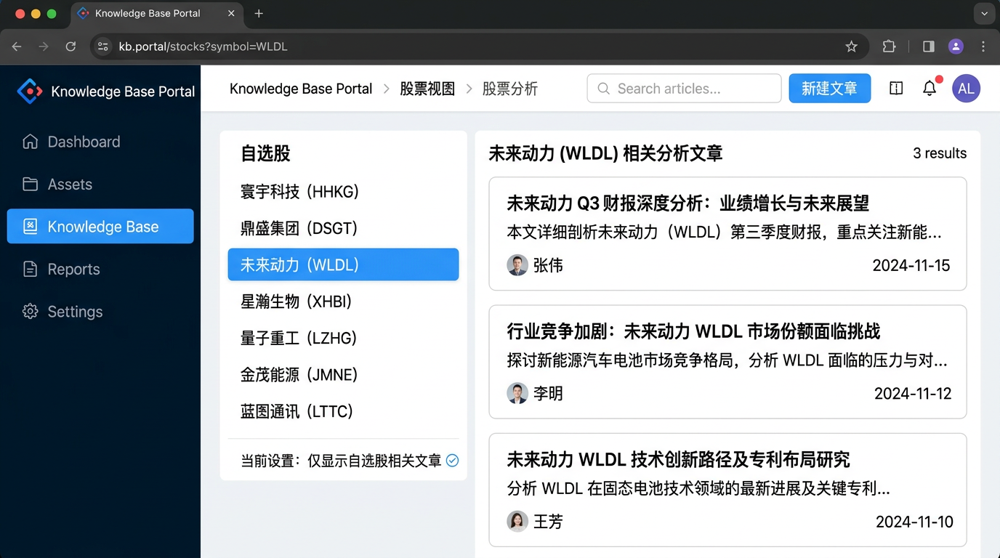

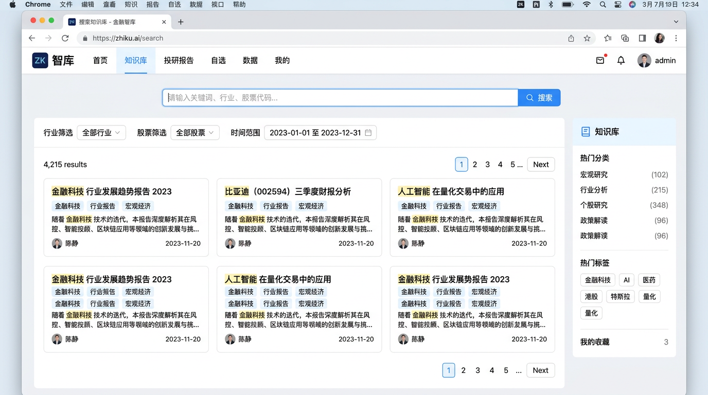

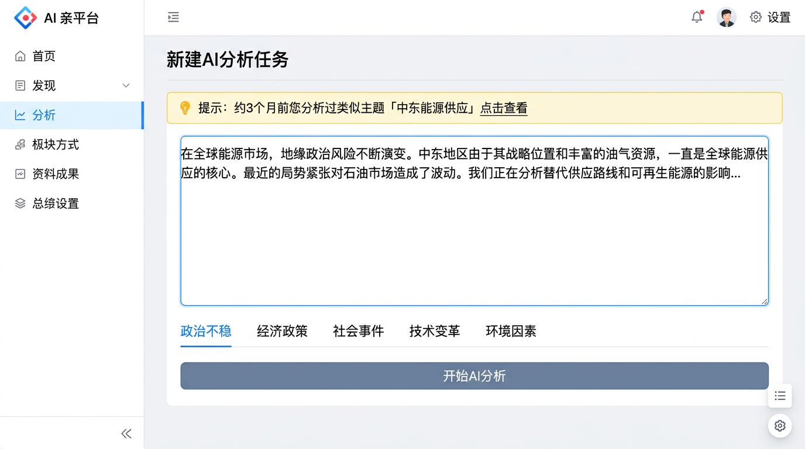

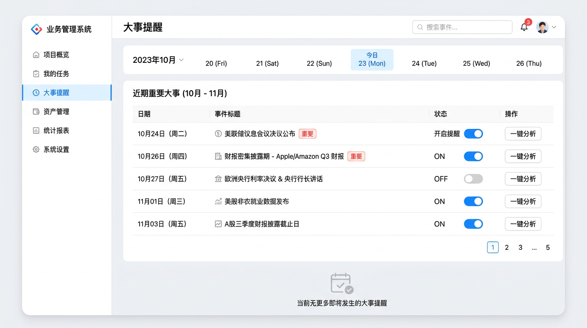

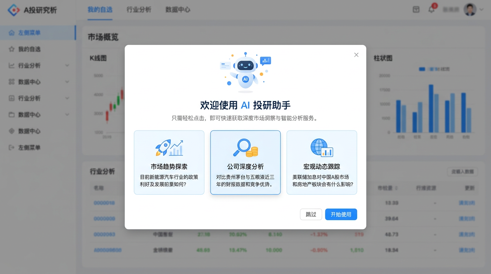

---

*文档版本：1.0 · 与产品概览模块一及 `docs/mockups/module1/*.png` 配套使用。*
