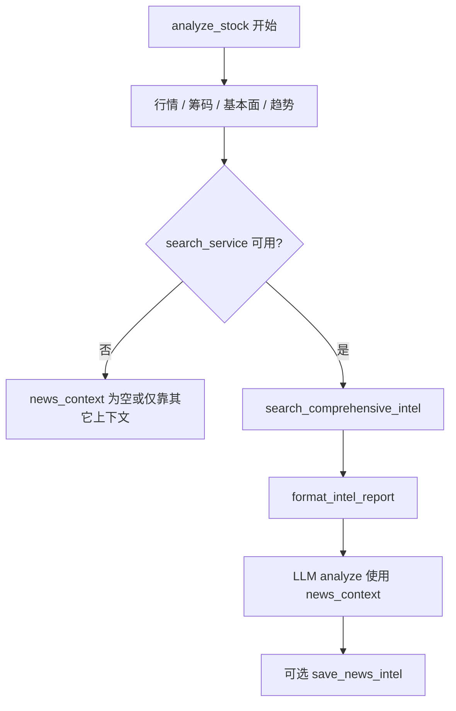

# 搜索模块迁移说明（自建项目集成）

本文说明：**若要将本项目的「多引擎新闻搜索」能力接入你自己的工程**，需要拷贝/依赖哪些代码、在本仓库里**搜索是如何被触发**的，以及**端到端搜索流程**。

---

## 一、需要拷贝或等价实现的代码

### 1. 核心文件（必拷贝）

| 路径 | 说明 |
|------|------|
| `src/search_service.py` | **整文件**。内含所有搜索引擎 Provider、`SearchService`、`fetch_url_content`（newspaper3k 拉正文）、缓存与 `get_search_service()` 单例辅助函数。 |

拷贝后必须修改文件内的 **import**，指向你项目中的模块（见下表）。

### 2. 必须拆出的少量逻辑（不要整份拷贝 `src/config.py`）

`search_service.py` 顶部依赖：

- `NEWS_STRATEGY_WINDOWS`
- `normalize_news_strategy_profile`
- `resolve_news_window_days`

推荐在你项目中新建一个小模块（例如 `news_strategy.py`），从本仓库 `src/config.py` 复制下列片段即可：

- 常量 `NEWS_STRATEGY_WINDOWS`（`ultra_short` / `short` / `medium` / `long` 对应天数）
- 函数 `normalize_news_strategy_profile`
- 函数 `resolve_news_window_days`

然后把 `search_service.py` 里的：

```python
from src.config import (NEWS_STRATEGY_WINDOWS, ...)
```

改为你的包路径。

### 3. 工具函数（小文件或内联）

`search_service.py` 依赖：

```python
from data_provider.us_index_mapping import is_us_index_code
```

用于判断是否为美股指数代码（影响语言偏好等启发式）。

**做法：** 拷贝 `data_provider/us_index_mapping.py` 中 **`US_INDEX_MAPPING` + `is_us_index_code`**，或整文件拷贝 `us_index_mapping.py` 并改 import。

### 4. 建议重写而非拷贝：`get_search_service()`

文件末尾的 `get_search_service()` 会通过 `from src.config import get_config` 读取完整应用配置。迁入你自己的项目时：

- **推荐**：删除或重写该单例，改为从你的环境变量 / 配置中心构造：

```python
SearchService(
    bocha_keys=[...],
    tavily_keys=[...],
    anspire_keys=[...],
    brave_keys=[...],
    serpapi_keys=[...],
    minimax_keys=[...],
    searxng_base_urls=[...],
    searxng_public_instances_enabled=True,
    news_max_age_days=3,
    news_strategy_profile="short",
)
```

否则你会被迫引入本项目整套 `Config`。

### 5. Python 依赖（按实际启用的引擎安装）

| 用途 | 包名（参考原 `requirements.txt`） |
|------|----------------------------------|
| HTTP / 重试 | `requests`、`tenacity` |
| SerpAPI 结果页正文补强 | `newspaper3k`（常见还需 `lxml_html_clean` 兼容新版 lxml） |
| Tavily | `tavily-python` |
| SerpAPI | `google-search-results`（`from serpapi import GoogleSearch`） |
| 部分日期解析分支 | `python-dateutil` |

其余 Provider（Anspire / Bocha / Brave / MiniMax / SearXNG）在代码中多用 **`requests` 调 REST**，无需额外 SDK（以 `search_service.py` 实现为准）。

---

## 二、本项目已实现的搜索引擎（7 类）

均在 `src/search_service.py` 中，继承 `BaseSearchProvider`：

1. **Anspire** — `AnspireSearchProvider`（配置后在列表中最前 `insert(0)`）
2. **博查 Bocha** — `BochaSearchProvider`
3. **Tavily** — `TavilySearchProvider`
4. **Brave** — `BraveSearchProvider`
5. **SerpAPI** — `SerpAPISearchProvider`（可选用 newspaper 拉 organic 链接正文）
6. **MiniMax** — `MiniMaxSearchProvider`
7. **SearXNG** — `SearXNGSearchProvider`（自建实例或公共实例发现）

未配置任何 Key / 可用实例时，`SearchService.is_available` 为 `False`，上游会跳过搜索。

---

## 三、环境变量与 Config 注入（本仓库中的对应关系）

全局配置从环境变量解析为多 Key 列表（逗号分隔），典型变量名（详见 `.env.example` 与 `src/config.py`）：

| 环境变量（示例） | 注入 `SearchService` 的参数 |
|------------------|---------------------------|
| `ANSPIRE_API_KEYS` | `anspire_keys` |
| `BOCHA_API_KEYS` | `bocha_keys` |
| `TAVILY_API_KEYS` | `tavily_keys` |
| `BRAVE_API_KEYS` | `brave_keys` |
| `SERPAPI_API_KEYS` | `serpapi_keys` |
| `MINIMAX_API_KEYS` | `minimax_keys` |
| `SEARXNG_BASE_URLS` | `searxng_base_urls` |
| `NEWS_MAX_AGE_DAYS`、`NEWS_STRATEGY_PROFILE` | `news_max_age_days`、`news_strategy_profile` |

`StockAnalysisPipeline` 构造时把这些列表从 `Config` 传入 `SearchService`（与 `get_search_service()` 单例使用的字段一致）。

---

## 四、在本项目中「搜索是如何被触发的」

### 1. 主路径：单只股票分析（非 Agent 传统链路）

**入口：** `StockAnalysisPipeline.analyze_stock()` 在跑完实时行情、筹码、基本面、趋势等之后，进入 **Step 4**。

**条件：** `self.search_service is not None and self.search_service.is_available`。

**调用：**

1. `search_comprehensive_intel(stock_code, stock_name, max_searches=5)`  
   - 多维度查询（最新消息、机构分析、风险、公告、业绩、行业等），每个维度按配置轮流选一个 Provider，且总次数受 `max_searches` 限制。
2. `format_intel_report(intel_results, stock_name)`  
   - 拼成一段 **字符串 `news_context`**，后续喂给 `GeminiAnalyzer.analyze(..., news_context=...)`。
3. 可选：将各维度结果写入数据库 `save_news_intel`（用于历史与复盘）。

对应代码位置：`src/core/pipeline.py`（Step 4 多维度情报搜索）。

### 2. 分支路径：Agent 分析模式

当配置启用 Agent 分支（`analyze_stock` 内 `use_agent` 为真）时，主循环走 `_analyze_with_agent`，**不再**在 Step 4 执行上述「多维度 comprehensive」拼报告（工具链由 Agent 调度）。

在 Agent 分析结束后，为 **落库** 会额外调用一次：

- `search_stock_news(stock_code, stock_name, max_results=5)`  

仅用于保存 `latest_news` 维度到数据库，与「给 LLM 主上下文」的那套 comprehensive 流程分离。

对应代码位置：`src/core/pipeline.py`（Agent 模式保存新闻情报）。

### 3. 其它潜在入口（了解即可）

- `src/search_service.py` 底部 `get_search_service()`：供脚本或模块懒加载单例，依赖完整 `get_config()`。
- `search_stock_events(...)`：事件类关键词搜索，可在扩展功能中单独调用。

---

## 五、搜索流程（端到端）

### 1. 业务层（本仓库）



### 2. `SearchService` 内部（概念）

- **Provider 列表**：初始化时按配置追加；Anspire 配置存在时插入列表首位。
- **`search_comprehensive_intel`**：  
  - 按 A 股 / 港股美股 / 指数 ETF 选择不同 **query 模板**与维度；  
  - **轮询** `available_providers` 为每个维度分配一个引擎；  
  - 对 `strict_freshness` 维度做 **按日发布日期过滤**；  
  - 维度之间 `sleep(0.5)` 减轻限流。
- **`search_stock_news`**：  
  - 构造单条新闻类 query；  
  - **按 Provider 顺序依次尝试**，直至过滤后有结果（中文场景下还有「中文结果优先」策略）；  
  - 带内存缓存与并发去重（同 key 等待填充）。

### 3. 单个 Provider

- `BaseSearchProvider`：Key 轮询、错误计数、`_do_search` 由各厂商子类实现（HTTP/SDK）。
- SerpAPI 路径下可对 organic 链接调用 **`fetch_url_content`**（newspaper3k）合并进摘要。

---

## 六、集成到你项目的最小调用示例

在你自己的工程中，只要实例化 `SearchService` 并调用公开方法即可，无需 pipeline：

```python
from your_pkg.search_service import SearchService  # 改名后的模块

svc = SearchService(
    tavily_keys=["xxx"],  # 至少配置一种引擎
    serpapi_keys=[],
    news_max_age_days=3,
    news_strategy_profile="short",
)

if svc.is_available:
    r = svc.search_stock_news("600519", "贵州茅台", max_results=5)
    # 或
    intel = svc.search_comprehensive_intel("600519", "贵州茅台", max_searches=5)
    text = svc.format_intel_report(intel, "贵州茅台")
```

---

## 七、小结

| 项目 | 内容 |
|------|------|
| **必拷贝** | `src/search_service.py` 全文 |
| **必抽离** | `NEWS_STRATEGY_*` 相关 3 项（来自原 `config.py` 的小段） |
| **小依赖** | `is_us_index_code`（`us_index_mapping` 或等价实现） |
| **建议改写** | `get_search_service()`，避免依赖本项目完整 `Config` |
| **触发位置** | `StockAnalysisPipeline.analyze_stock` Step 4 → `search_comprehensive_intel` + `format_intel_report`；Agent 模式结束后 → `search_stock_news` 仅落库 |

本文档随仓库维护；若上游将搜索逻辑拆分为独立包，以仓库最新结构为准。
