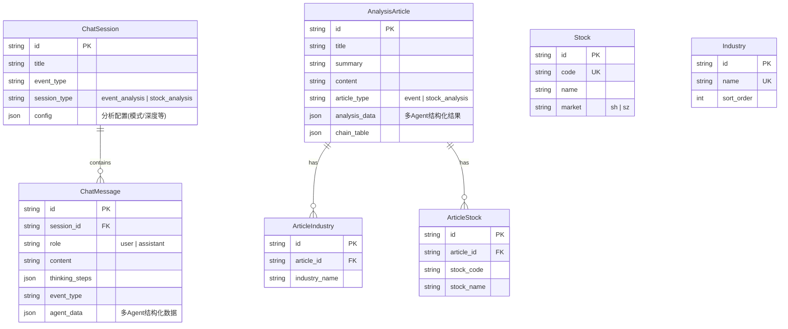

# Data Model: 个股多Agent深度分析

**Feature Branch**: `003-stock-analysis`
**Date**: 2026-04-22

---

## 实体关系



---

## 模型变更

### AnalysisArticle 扩展

| 字段 | 类型 | 说明 |
|------|------|------|
| `article_type` | String(20) | 新增。'event'（事件分析，默认）/ 'stock_analysis'（个股深度分析）|
| `analysis_data` | JSON | 新增。存储多Agent分析的结构化数据 |

**analysis_data JSON 结构**：

```json
{
  "stock_code": "300750",
  "stock_name": "宁德时代",
  "analysis_mode": "full",
  "agents": {
    "market": {
      "status": "done",
      "summary": "技术面摘要...",
      "full_report": "完整技术面分析...",
      "data_sources": ["akshare"]
    },
    "fundamentals": {
      "status": "done",
      "summary": "基本面摘要...",
      "full_report": "完整基本面分析...",
      "data_sources": ["akshare"]
    },
    "news": {
      "status": "done",
      "summary": "新闻摘要...",
      "full_report": "完整新闻分析..."
    },
    "sentiment": {
      "status": "done",
      "summary": "情绪摘要...",
      "full_report": "完整情绪分析..."
    }
  },
  "debate": {
    "rounds": 2,
    "bull_arguments": ["看多论据1...", "看多论据2..."],
    "bear_arguments": ["看空论据1...", "看空论据2..."],
    "investment_plan": "投资计划..."
  },
  "risk_debate": {
    "rounds": 2,
    "risky_view": "激进观点...",
    "safe_view": "保守观点...",
    "neutral_view": "中立观点...",
    "risk_judgment": "风险裁决..."
  },
  "decision": {
    "action": "买入",
    "target_price": 280.0,
    "confidence": 0.72,
    "risk_score": 0.35,
    "reasoning": "决策理由..."
  }
}
```

### ChatMessage 扩展

| 字段 | 类型 | 说明 |
|------|------|------|
| `agent_data` | JSON | 新增。存储当前消息关联的多Agent中间数据 |

**agent_data JSON 结构**（assistant 消息中使用）：

```json
{
  "current_agent": "market_analyst",
  "current_phase": "analysts",
  "agent_statuses": {
    "market_analyst": "done",
    "fundamentals_analyst": "running",
    "news_analyst": "pending",
    "sentiment_analyst": "pending",
    "bull_researcher": "pending",
    "bear_researcher": "pending",
    "research_manager": "pending",
    "trader": "pending",
    "risky_debator": "pending",
    "safe_debator": "pending",
    "neutral_debator": "pending",
    "risk_judge": "pending"
  }
}
```

### ChatSession 扩展

| 字段 | 类型 | 说明 |
|------|------|------|
| `session_type` | String(20) | 新增。'event_analysis'（默认）/ 'stock_analysis' |
| `config` | JSON | 新增。分析配置参数 |

**config JSON 结构**：

```json
{
  "stock_code": "300750",
  "stock_name": "宁德时代",
  "analysis_mode": "full",
  "debate_rounds": 2,
  "risk_debate_rounds": 2
}
```

---

## 状态字段说明

### 分析阶段枚举

| 值 | 说明 |
|---|------|
| `analysts` | 分析师阶段（技术面/基本面/新闻/情绪） |
| `debate` | 投资辩论阶段（Bull vs Bear） |
| `trader` | 交易决策阶段 |
| `risk` | 风险辩论阶段 |
| `done` | 分析完成 |

### Agent 标识枚举

| 值 | 显示名称 | 阶段 |
|---|---------|------|
| `market_analyst` | 技术面分析 | analysts |
| `fundamentals_analyst` | 基本面分析 | analysts |
| `news_analyst` | 新闻分析 | analysts |
| `sentiment_analyst` | 情绪分析 | analysts |
| `bull_researcher` | 看多论证 | debate |
| `bear_researcher` | 看空论证 | debate |
| `research_manager` | 投资裁决 | debate |
| `trader` | 交易决策 | trader |
| `risky_debator` | 激进风险观点 | risk |
| `safe_debator` | 保守风险观点 | risk |
| `neutral_debator` | 中立风险观点 | risk |
| `risk_judge` | 风险裁决 | risk |

---

## 数据库迁移

### 新增字段

```sql
-- AnalysisArticle 新增字段
ALTER TABLE t_analysis_article ADD COLUMN article_type VARCHAR(20) NOT NULL DEFAULT 'event'
  COMMENT '文章类型: event=事件分析, stock_analysis=个股深度分析';
ALTER TABLE t_analysis_article ADD COLUMN analysis_data JSON
  COMMENT '多Agent分析结构化数据';

-- ChatSession 新增字段
ALTER TABLE t_chat_session ADD COLUMN session_type VARCHAR(20) NOT NULL DEFAULT 'event_analysis'
  COMMENT '会话类型: event_analysis=事件分析, stock_analysis=个股分析';
ALTER TABLE t_chat_session ADD COLUMN config JSON
  COMMENT '分析配置参数(股票代码/模式/轮次等)';

-- ChatMessage 新增字段
ALTER TABLE t_chat_message ADD COLUMN agent_data JSON
  COMMENT '多Agent中间数据(Agent状态/进度等)';
```

### 索引

```sql
CREATE INDEX idx_article_type ON t_analysis_article(article_type);
CREATE INDEX idx_session_type ON t_chat_session(session_type);
```
